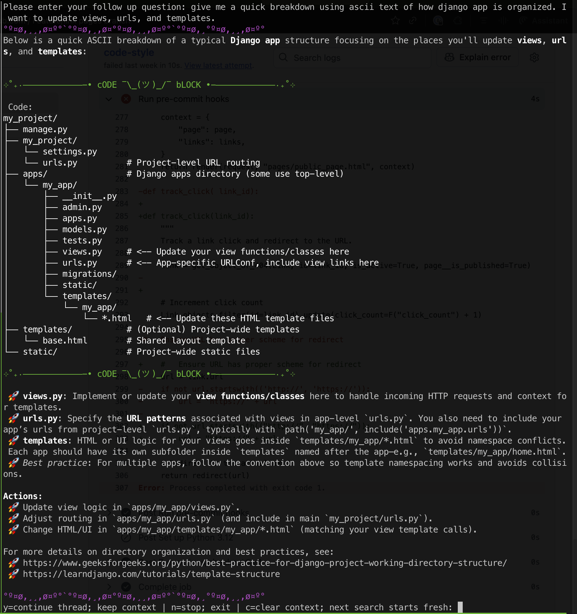

# 🧠 NerdPrompt

## 🎬 Demo

<div align="center">


</div>

**AI formatted for tricked out terminals now with customizable ANSI colors, emojis, ASCII art dividers, code detection and code syntax highlighting with follow up questions (threads)** (Currently tested with Perplexity.AI, should work with ChatGPT, Claude, Cohere)

In the default mode NerdPrompt keeps context while asking follow up questions, but you can clear context to reset the thread topic and keep going.

**Options:**
- `-n` / `--nothread`: Output the response and nothing else
- `-p` / `--prompt`: 'default', 'concise', 'command', but you can set your own. Default system prompt focuses on colorful output, examples, for the computer professional. 'concise' prompt for shrinking answers to fewest tokens possible, and 'command' for only responding with the command you asked for.
- `-r` / `--raw`: Output raw markdown without ANSI formatting - perfect for AI agents and piping to other tools 

## Screenshots

<div align="center">




</div>

### No-Thread Mode: Command-Only Response and Exit
<div align="center">

</div>

### NeoVim Integration
**Set up with "leader key + np hotkey" [HERE](https://github.com/interwebologist/neovim_config/blob/fd8320c6e7d1a5ed117c335bf4a620bad66f6995/init.lua#L32-L50)**

With Noice installed, this provides a popup floating in the middle of the screen before splitting to run NerdPrompt.

<div align="center">

</div>

---

## 🚀 Features

- **Custom terminal styling**: Emoji, ANSI colors, or ASCII-enhanced bullet points
- **Flexible dividers**: Horizontal dividers for content and code blocks
- **Custom headers**: Match your terminal/vim theme colors with underlines and styling
- **Rich text formatting**: Bold, italic, and combined formatting rendered in terminal
- **Clean output**: Removes citation markers like "[1]" for cleaner Perplexity.ai responses
- **Syntax highlighting**: 40+ Pygments themes for code blocks with custom dividers
- **Multiple system prompts**: Choose between 'default', 'concise', or 'command' modes, or create custom prompts in config.yaml
- **Raw output mode**: Perfect for AI agents and integration with other tools

---

## 🔧 Installation

Follow these steps to install Nerd Prompt:

1. **Clone the repository:**

    ```
    git clone https://github.com/interwebologist/NerdPrompt.git
    cd NerdPrompt
    ```

2. **Create and activate a virtual environment (recommended):**

    ```
    python3 -m venv venv
    # On Linux or macOS:
    source venv/bin/activate
    # On Windows:
    venv\Scripts\activate
    ```

3. **Install dependencies:**

    ```
    pip install -r requirements.txt
    ```

4. **Set up your API key (see below).**

---

**Note:**  
Using a virtual environment (`venv`) keeps dependencies isolated from your system Python and is best practice for Python projects.

---

## 🔑 Setting Up Your API Key

To use **Nerd Prompt**, you need an API key from Perplexity.ai. Here's how to get it:

1. **Log in to Perplexity.ai**: Visit [www.perplexity.ai](https://www.perplexity.ai) and log in to your account.
2. **Navigate to Settings**: Click on the **Settings** icon (bottom-left corner).
3. **Access the API Tab**: Select the **API** tab from the menu.
4. **Generate or Copy Your API Key**: Click "Generate API Key" if you don't already have one, or copy your existing key.
5. Save your API key securely.

---

## 🛠️ Configuring Your API Key

1. Create a `.env` file in the project directory:

```bash
touch .env
```

2. Add your API key to the `.env` file:

```plaintext
API_KEY=your_api_key_here
```

3. The project will automatically load the key from the `.env` file when you run it.

---

## 🖥️ Usage Instructions

### Basic Usage
Run the script with your query as an argument:

```bash
python nerdprompt.py "What is the capital of France?"
```

### System Prompt Selection
Choose different response styles with the `-p` flag:

```bash
# Default prompt (detailed responses)
python nerdprompt.py "Explain Python decorators"

# Concise prompt (token-efficient responses) 
python nerdprompt.py -p concise "Explain Python decorators"

# Custom prompt (add your own in config.yaml)
python nerdprompt.py -p custom "Tell me about the weather"
```

### Raw Output Mode
For AI agents or piping to other tools:

```bash
python nerdprompt.py --raw "What is Docker?"
python nerdprompt.py -p concise --raw "Explain APIs"
```

### No Thread Mode
Exit after showing response without threading capability:

```bash
# No threading - returns only the answer and exits
python nerdprompt.py --nothread "What is Python?"
python nerdprompt.py -n "Explain machine learning"

# Command-only responses (perfect for getting specific commands)
python nerdprompt.py -p command -n "roll back git commit 1 commit"
python nerdprompt.py -p command --nothread "list all docker containers"
```

**Pro Tip:** Set up an alias to run commands without activating the Python environment:

```bash
# Add to your ~/.bashrc or ~/.zshrc
alias nerdprompt="/path/to/your/NerdPrompt/venv/bin/python /path/to/your/NerdPrompt/nerdprompt.py"

# Usage examples:
nerdprompt "What is Docker?"
nerdprompt -p concise "Explain APIs"
nerdprompt -p command -n "list all running processes"
```

---

## ✨ Markdown Formatting in Terminal

The tool supports formatting for the Terminal:

- **Headers** are styled with different colors. Example:
    - Green for `# Header`
    - Blue for `## Subheader`
    - Red for `### Sub-subheader`
- Text styling includes:
    - **Bold**
    - *Italic*
    - ***Bold Italic***
- Emoji-enhanced bullet points like 🚀, 🔥, and ✨ add personality to your terminal output.
- Add your own ASCII art dividers or dividers with emoji's

---

## 💡 Best Practices

- **Security**: Keep your API key private and never share it publicly
- **Credits**: Ensure sufficient credits in your Perplexity.ai account (Pro users receive $5/month free credits at time of writing)
- **Compatibility**: Requires Python 3.8 or higher
- **Performance**: Use virtual environments to isolate dependencies

---

## ❓ Troubleshooting

If you encounter issues:

1. **API Key Issues**: Ensure your `.env` file contains a valid API key
2. **Dependencies**: Verify all dependencies are installed (`pip install -r requirements.txt`)
3. **Account Status**: Check your Perplexity.ai account for sufficient credits and active API keys
4. **Python Version**: Confirm you're using Python 3.8 or higher
5. **Virtual Environment**: Make sure your virtual environment is activated

For additional support, consult [Perplexity's Help Center](https://www.perplexity.ai/help-center).

---

## 🎨 Code Syntax Highlighting Themes

This project uses [Pygments](https://pygments.org/) for code syntax highlighting. You can customize the appearance of code blocks by selecting one of the many available Pygments styles. For a live preview of each theme, visit the [Pygments demo page](https://pygments.org/demo/).

**To set a style, configure your formatter in the config.yaml with the desired style name.**  
For example, in Python:

### Available Code Styles

Below is a list of supported syntax highlighting themes:

- abap
- algol
- algol_nu
- arduino
- autumn
- bw
- borland
- coffee
- colorful
- default
- dracula
- emacs
- friendly_grayscale
- friendly
- fruity
- github-dark
- gruvbox-dark
- gruvbox-light
- igor
- inkpot
- lightbulb
- lilypond
- lovelace
- manni
- material
- monokai
- murphy
- native
- nord-darker
- nord
- one-dark
- paraiso-dark
- paraiso-light
- pastie
- perldoc
- rainbow_dash
- rrt
- sas
- solarized-dark
- solarized-light
- staroffice
- stata-dark
- stata-light
- tango
- trac
- vim
- vs
- xcode
- zenburn

Enjoy using **Nerd Prompt**! 🚀
